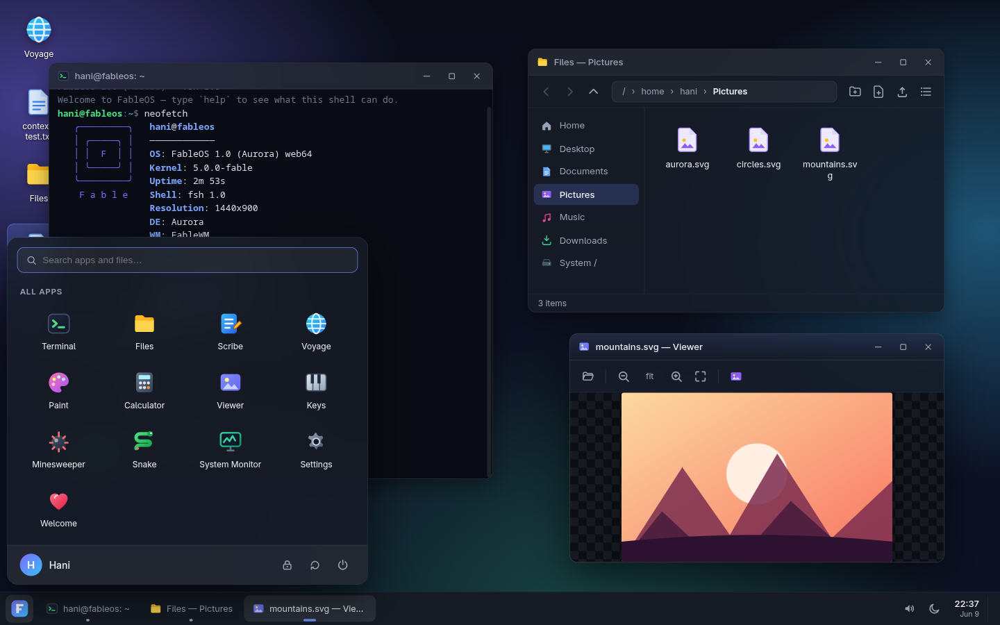

# FableOS

**A complete desktop operating system that runs in your browser tab.**

Kernel, persistent file system, window manager, terminal with a real shell, and
thirteen applications — built entirely from scratch in TypeScript with **zero
runtime dependencies**. The only things in `package.json` are Vite and the
TypeScript compiler.


## Run it

```sh
npm install
npm run dev          # → http://localhost:5173
```

Production build (static files, host anywhere):

```sh
npm run build        # outputs dist/ (~42 KB JS gzipped)
npm run preview      # → http://localhost:4173
```

## What's inside

| Layer | What it does |
|---|---|
| **Kernel** (`src/core/kernel.ts`) | App registry, process table with PIDs, launch/kill lifecycle, system power actions |
| **VFS** (`src/core/vfs.ts`) | Full virtual file system held in memory, persisted to IndexedDB (localStorage fallback). Files survive reboots |
| **FableWM** (`src/ui/wm.ts`) | Dragging, 8-direction resizing, edge snapping (left/right halves, top to maximize) with live preview, minimize/maximize animations, focus and z-order |
| **Shell UI** (`src/ui/`) | Boot sequence, lock screen, shutdown screen, desktop with icons and wallpapers, taskbar with tray + calendar, start menu with app/file search, context menus, dialogs, toast notifications |

### Applications

- **Terminal (FableTerm/fsh)** — a real shell: pipes `|`, redirection `>` `>>`,
  `&&` chaining, quoting, `~`/`$VAR` expansion, tab completion, persistent
  history, ~40 commands (`ls`, `grep`, `tree`, `ps`, `kill`, `neofetch`,
  `cowsay`, `js`, `curl`, …)
- **Files** — grid/list views, breadcrumbs, cut/copy/paste across windows,
  drag-&-drop moves, rename/delete/properties, import from and export to your
  real computer
- **Scribe** — text editor with line numbers, dirty tracking, Ctrl+S, save-as
  via system file picker, live Markdown preview
- **Voyage** — browser that renders `.html` files from the VFS in a sandboxed
  frame (scripts run!) plus embeddable real-web sites
- **Paint** — pen/eraser/shapes/flood-fill/eyedropper, undo/redo, saves PNGs
  into the VFS
- **Calculator** — hand-written expression parser (no `eval`), history tape
- **Viewer** — image viewer with zoom and *set as wallpaper*
- **Keys** — two-octave WebAudio synth piano with keyboard mapping and a demo song
- **Minesweeper** & **Snake** — first-click-safe sweeping; high scores persist
- **System Monitor** — process table with End-task, CPU/heap charts, FPS
- **Settings** — themes (dark/light), accent colors, wallpapers, identity,
  storage usage, factory reset
- **Welcome** — first-boot tour

### Things to try

```
neofetch                         # system info with ASCII art
echo "hi" > ~/notes.txt          # then find it in Files
ls /bin | grep e                 # pipes work
tree ~                           # the whole home directory
open ~/Pictures/aurora.svg       # opens the Viewer
js [1,2,3].map(x => x*2)         # inline JavaScript
panic                            # do not run panic
```

- Drag a window against the screen edges to snap it; double-click a title bar to maximize.
- `Ctrl+Alt+T` opens a terminal anywhere.
- Right-click everything — desktop, files, taskbar buttons.
- Reload the tab: your files, wallpaper, history and high scores are still there.
- Settings → System → *Reset FableOS* wipes the disk and reboots to the factory image.

## Architecture notes

- Everything is DOM + CSS; no canvas-rendered UI, no frameworks. A ~40-line
  `h()` helper builds all UI.
- The whole FS tree lives in memory for synchronous reads; every mutation
  debounces a persist into a single IndexedDB record.
- Apps are plain manifests: `{ id, name, icon, window, launch(ctx) }`. The
  kernel creates the window, the app renders into `ctx.root` and registers
  cleanups with `ctx.onClose()`.
- All icons are inline SVG — no emoji or icon-font dependencies, renders the
  same everywhere.



---

Built from an empty directory by **Fable 5** (Claude), Anthropic's AI — kernel
to cowsay, in one session.
