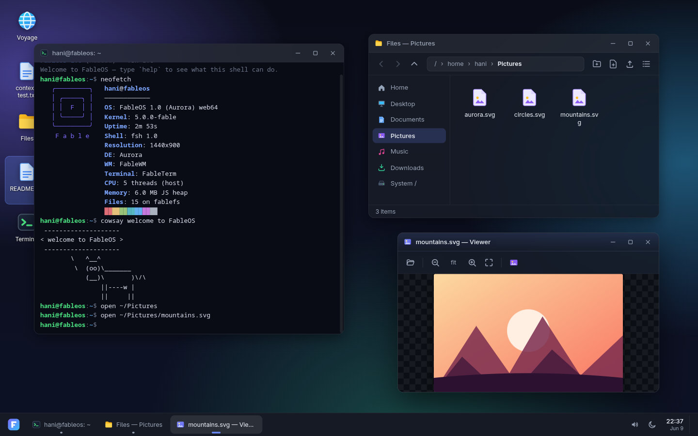
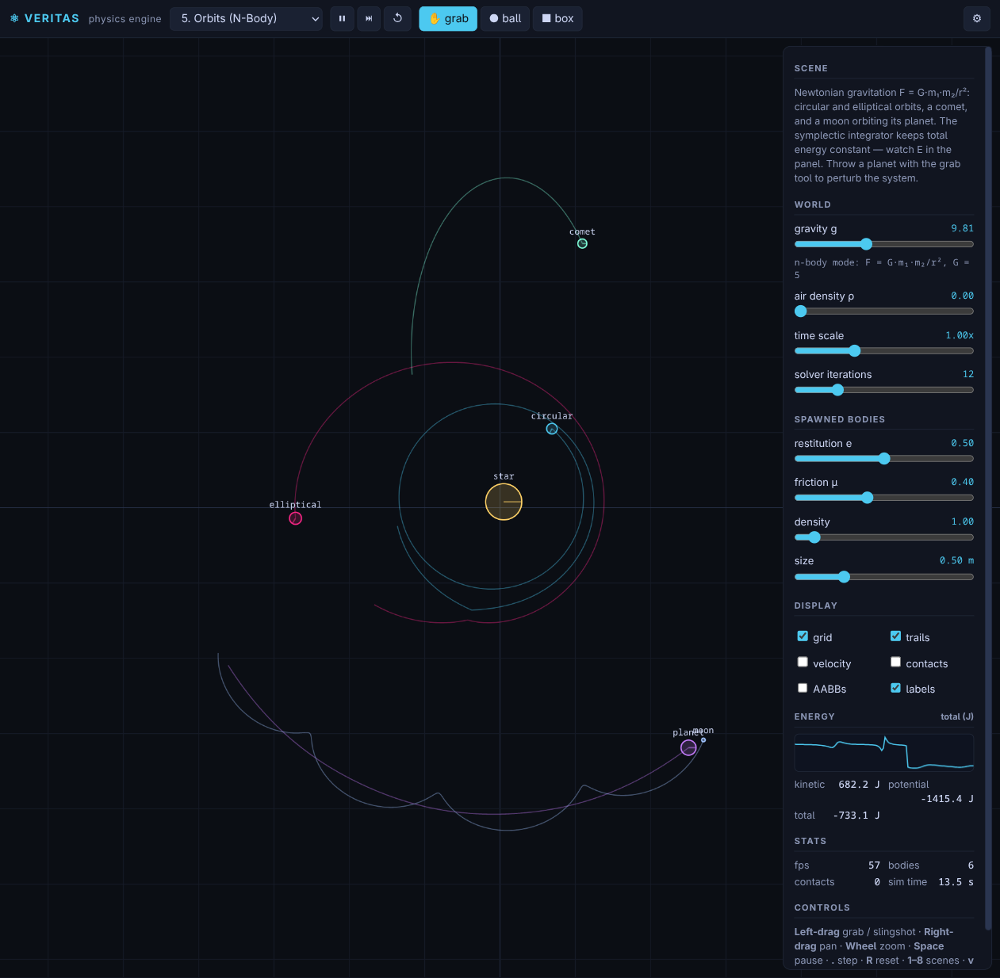
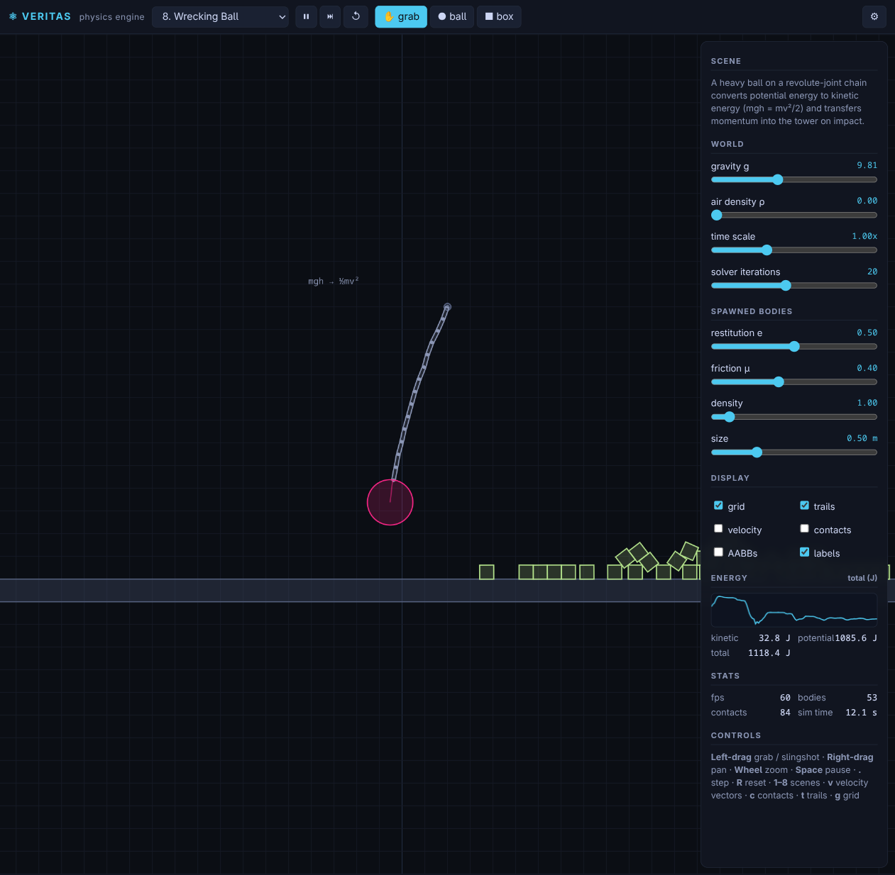
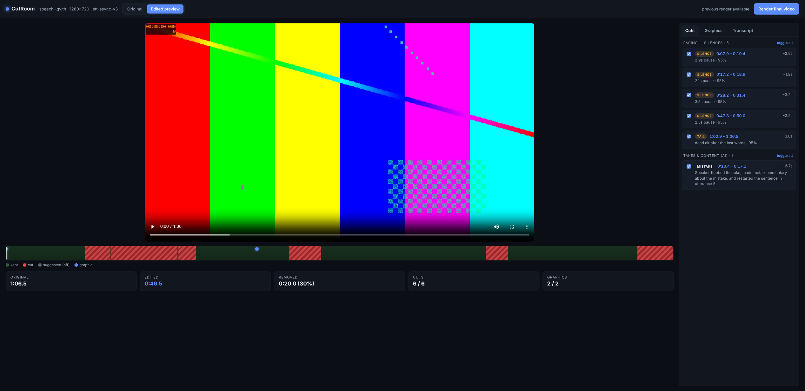
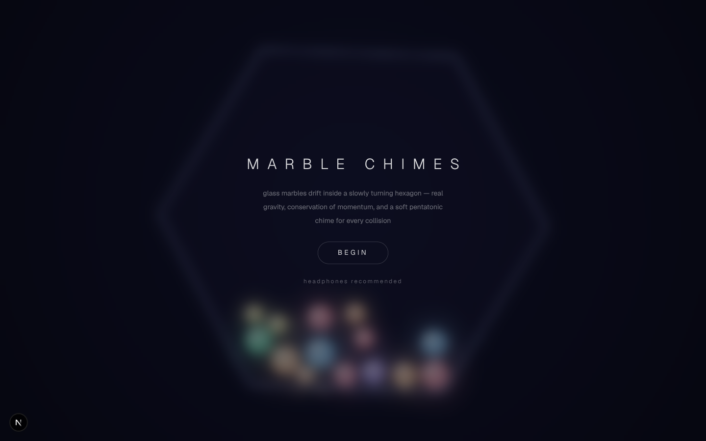

# Fable 5

<h3 align="center">AI-Generated Interactive Prototypes, Web Applications & Physics Engines</h3>

<p align="center">
A showcase of web applications, 3D flight simulators, physics engines, desktop OS emulators, and creative tools produced by Fable 5 AI.
</p>


## Overview

Fable 5 is an Artificial Intelligence (AI) system designed for generating interactive web applications, high-performance physics engines, 3D simulators, creative tools, and web environments.

This repository is the direct result of using Fable 5 AI — serving as a showcase for interactive web experiments, software architectures, WebGL/Three.js rendering, custom physics solvers, and creative web applications generated by Fable 5.

Available and runnable across Windows, Linux & MacOS using standard web toolchains.


## Tech Stack

* **Frontend Frameworks & Libraries**: React 19, Next.js 15, Vite, D3.js, TopoJSON, Tailwind CSS
* **3D Graphics & WebGL**: Three.js, Custom WebGL shaders, Voxel Rendering
* **Physics & Audio**: Custom 2D Rigid-Body Physics Engine, Web Audio API (ASMR audio synthesis)
* **Languages & Automation**: TypeScript, JavaScript (ES6+), Python, Shell scripts
* **Package Managers**: `npm`, `pnpm`, `yarn`


## Features

### Web OS & Desktop Simulation

Experience a full desktop environment directly in the browser:

* Multi-window manager with draggable windows
* Built-in apps: Terminal, Paint, Calculator, File Explorer, Browser, Minesweeper
* Customizable settings and desktop icons

### Physics & ASMR Engines

Explore real-time physical systems and interactive audio:

* **Real Physics Engine**: Custom 2D rigid-body physics solver (joints, impulse solver, collision detection)
* **Physics ASMR**: Interactive particle & physics simulation paired with real-time generative audio synthesis
* **Fluid Dynamics**: WebGL fluid simulation with interactive particle forces

### 3D Simulators & WebGL Games

Immersive 3D environments powered by Three.js and WebGL:

* **FPV Drone Simulator**: Realistic drone flight controller, motor physics, and obstacle courses
* **3D Flight Simulator**: Airframe aerodynamics, camera modes, and flight HUD
* **Minecraft Voxel Engine**: Browser-based voxel world generator and physics
* **3D Web Game**: Interactive WebGL game mechanics and rendering

### Creative Tools & Productivity Apps

Web-based applications built for productivity and media creation:

* **Obsidian Web**: Feature-rich Markdown note-taking workspace with graph view and live preview
* **Video Editor**: Automated video editing engine, timeline builder, and web rendering pipeline
* **Arabic Motion**: Automated Arabic motion graphics and video editing tools

### Web Design & Arabic Typography

* **Arabic Landing Pages**: Collection of modern, responsive Arabic UI designs
* **Arabic Typography**: Web font rendering and layout experiments
* **Next.js Prototypes (`high-effort` & `xhigh-effort`)**: Showcase of modern Next.js UI components and web experiences


## Repository Structure & Sub-Projects

| Directory | Type | Description & Primary Stack |
| :--- | :--- | :--- |
| **`OS/`** | Web App | Full Web-based Desktop OS (Vite, React, TypeScript, CSS) |
| **`video-editor/`** | Web & CLI | Automated Video Editor & Timeline Engine (Node.js, Web UI) |
| **`obsidian/`** | Web App | Web Markdown Note-taking Workspace (React, Vite, Tailwind) |
| **`fpv-drone/`** | 3D Sim | FPV Drone Flight Simulator (Three.js, WebGL, ES6) |
| **`plane-game/`** | 3D Sim | 3D Flight Simulator with Airframe Dynamics (Three.js, Node) |
| **`real-physics-engine/`** | Physics | Custom 2D Rigid Body Physics Engine (Canvas 2D, Pure JS) |
| **`physics-asmr/`** | Web App | Particle Physics & ASMR Audio Synthesizer (Next.js, Web Audio) |
| **`fluid-exp/`** | WebGL | Fluid Dynamics & Particle Physics Simulation (Next.js, WebGL) |
| **`html-minecraft-max/`** | 3D Sim | Browser Voxel Engine & World Generator (HTML5, JS) |
| **`islamic-map/`** | Interactive | Historical Map Exploration (D3.js, TopoJSON, HTML5) |
| **`3d-game/`** | WebGL | 3D Web Game Prototype (Next.js, Three.js) |
| **`arabic-motion/`** | Automation | Arabic Motion Graphics & Video Pipeline (Node, Canvas) |
| **`arabic-landing-pages/`**| UI Design | Modern Arabic Landing Pages (Next.js, React) |
| **`arabic/`** | Web Design | Arabic Web Typography & Font Experiments (HTML, CSS) |
| **`blender/`** | 3D Assets | Blender Web Export & Rendering Assets |
| **`html/`** | Web Design | Pure HTML/CSS/JS Prototype Showcase |
| **`high-effort/`** | Showcase | Next.js Creative Component Lab |
| **`xhigh-effort/`** | Showcase | Advanced Next.js UI Prototypes |


## Screenshots

### Web OS Desktop


### Real Physics Engine



### Video Editor UI


### Physics ASMR Simulation



## Installation & Running

### 1. Clone the Repository

```bash
git clone https://github.com/hamzabellouch/Build-with-anthropic-fable-5.git
cd Build-with-anthropic-fable-5
```

### 2. Running React / Vite / Next.js Projects
For projects such as `OS`, `obsidian`, `video-editor`, `physics-asmr`, `high-effort`, or `3d-game`:

```bash
# Navigate into the project folder
cd OS

# Install dependencies
npm install

# Start development server
npm run dev
```

### 3. Running Static HTML / Canvas Experiments
For standalone HTML5/JS projects such as `real-physics-engine`, `plane-game`, `fpv-drone`, `html-minecraft-max`, or `islamic-map`:

```bash
# Option A: Open directly in browser
# Double-click index.html in your file explorer

# Option B: Run via local HTTP server
npx serve .
```


## Requirements

* **Browser**: Modern WebGL-capable browser (Chrome, Brave, Firefox, Edge, Opera, Safari)
* **Node.js**: v18.0.0 or higher (for Next.js, Vite, and React apps)
* **Package Manager**: `npm` (v9+), `pnpm` (v8+), or `yarn` (v1.22+)


## Workflow

1. Explore the repository and select a prototype or application from the directory table.
2. Navigate into the target project directory (`cd <project-name>`).
3. Install dependencies and start the local development server.
4. Experiment, customize, or build upon the existing modules.


## Contributing

Contributions, issues, and feature requests are welcome! Feel free to check the issues page or submit a pull request with new experiments and improvements.


> [!WARNING]
> Experiments and prototypes are provided for educational, research, and demonstrative purposes.


### <a name="Copyright©2026"></a> Copyright © 2026

Thank you for engaging with us. For inquiries or collaboration, please contact:  
hamzabellouchcontact@gmail.com

Stay connected and follow us on:  
[Facebook](https://facebook.com/hamzabellouch1) | [Instagram](https://instagram.com/hamzabellouch0) | [Twitter](https://twitter.com/hamzabellouch0) | [Telegram](https://t.me/hammzabellouch) | [LinkedIn](https://www.linkedin.com/in/hamzabellouch)


